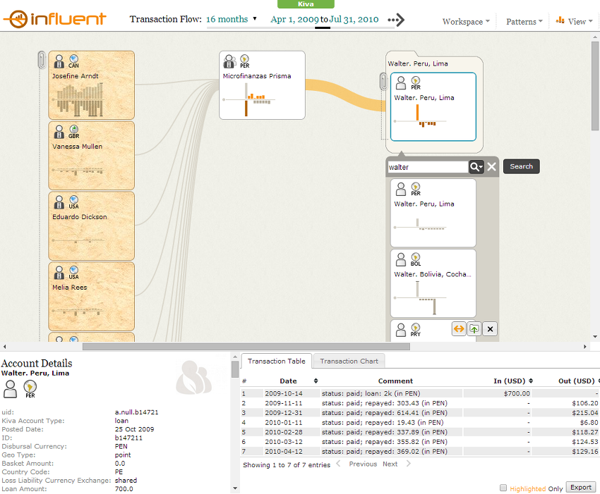
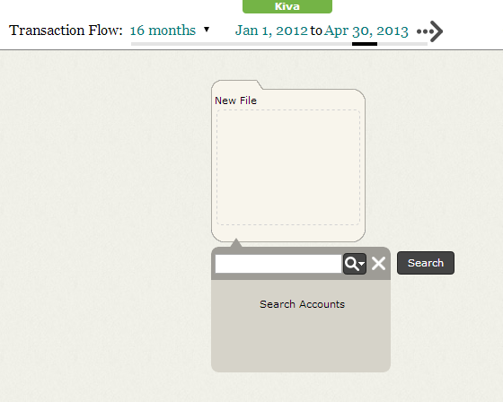
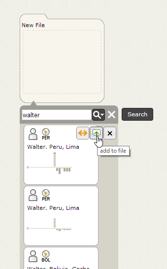
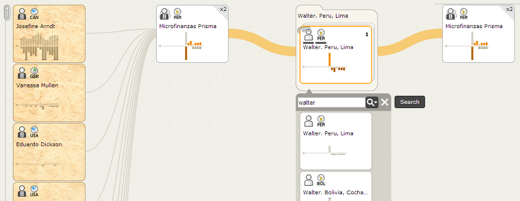
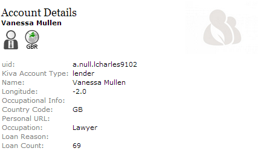
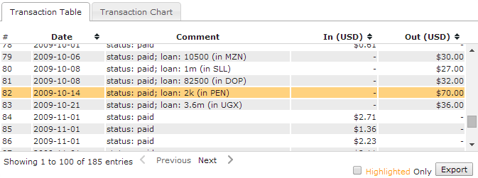
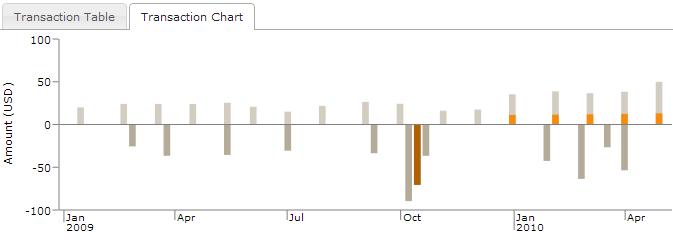
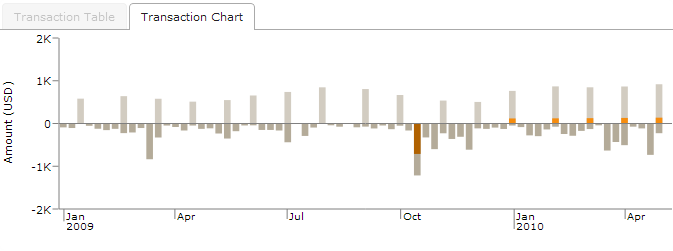

Interface
=========

The Influent user interface is divided into the following sections:

-   **[Header](#header)**: Influent's header allows you to:
    -   Select the **Transaction Flow** period over which to display transactions in the workspace.
    -   Access the **Workspace**, **Patterns** and **View** menus.
-   **[Workspace](#workspace)**: The Influent workspace is the environment in which you can search for accounts and view their incoming and outgoing transactions.

-   **[Details Pane](#details-pane)**: The Details Pane shows the following information for the selected account or cluster:
    -   **Account Details**, which include an individual account's summary information and further attributes that do not fit on its card, such as detailed descriptions and photographs
    -   A **Cluster Member Summary** that shows an overview of the individual accounts in a selected cluster
    -   Complete, exportable **Transaction Tables** for individual accounts
    -   Expanded **Transaction Charts** for individual accounts and clusters of accounts.

Header
------

The Influent Header contains the following elements:

-   **Data Source Name**: This configurable banner indicates the data source with which you are working.
-   **Transaction Flow**: These fields enable you to quickly change the time frame over which to display transactions in the workspace. The **Transaction Flow** drop-down allows you to choose a preconfigured time period, while the **Start Date** and **End Date** fields allow you to choose when the selected period begins and ends.

-   **Menus**: The Influent menus allow you to quickly configure the workspace, find transaction patterns and import and export data.
    -   **Workspace** menu: This menu contains commands for creating a new blank workspace, importing previously generated Influent charts, exporting your current transaction flow chart and logging out of the application (if authentication is enabled).
    -   **Patterns**: This menu contains a command that enables you to search for [account activity patterns](activity-search.md) like the one you have currently loaded in the workspace.
    -   **View**: This menu allows to you configure the level of account detail displayed in the workspace.

Workspace
---------

The Influent workspace is the environment in which you search for accounts of interest and investigate their transaction flows with other accounts (and clusters of accounts). Each new workspace, contains an empty file folder and a **Search** Panel.

When you search for accounts, the results are listed below the file. Influent returns both individual accounts and clusters of accounts that have similar attributes. An account is represented as a single card, with the name of the account, its type, location, status (if applicable) and a histogram showing its total transactions over the specified period. A cluster is represented as a stack of cards held together by a paperclip, with similar summary information about all of the member accounts in the cluster.

You can mark an account or cluster that you want to investigate by clicking its **Add to File** button to move it into the empty file.

Once you have added an account or cluster to a file, you can view all of the transactions that flow into and out of it. Mouse over the filed account or cluster, then click one of the **Branch** buttons to the left or right of the card. Clicking the left **Branch** button shows all of the accounts that have sent transactions to the filed account, while the right **Branch** button shows accounts to which the filed account has sent transactions. Influent always depicts transaction flow from left to right, with senders on the left and receivers on the right.

Lines between accounts that have carried out a transaction indicate the total value of the transaction between them. Thicker lines mean greater transactions. In the Kiva data, this means that the thicker the line between two accounts, the more money was sent.

You can further expand your transaction flow chart by focusing on who sent or received transactions from accounts branching from your filed account. The histograms for branched accounts or clusters are selectively highlighted to show the portion of their total transactions sent to or received from the highlighted account.

Details Pane
------------

The Details Pane is only visible when you click on an account card or a cluster stack. For a selected account, the Details Pane shows:

-   **Account Details**: The Account Details section shows the account's name, location, any associated images, and a list of account attributes.
    
-   **Transaction Data**: The Transaction Data section is a group of tabbed transaction displays that show all of the selected account's transactions. The tabs in this section include:
    -   **Transaction Table**: This table lists all of the transactions made with the selected account over the specified Transaction Flow period. Fields in the table include the Date, applicable Comments and the total transaction value going into or out of the account. The table can also be filtered to show only transactions made with the account currently highlighted in the workspace (surrounded by an orange border).
        
    -   **Transaction Chart**: This chart is an expanded view of the histogram that appears on the selected account card in the workspace. If there are any transactions between the selected account and the highlighted account, their values are shown in color on the chart.
        

For a selected cluster, the Details Pane shows:

-   **Cluster Member Summary**: This section lists the number of member accounts in the cluster and the percentage of accounts in the cluster that belong to each account type, location and account status.
    
-   **Transaction Chart**: This chart is an expanded view of the histogram that appears on the cluster card in the workspace. If there are any transactions between the selected cluster and the highlighted account, those transaction values are shown in color on the chart.
    

