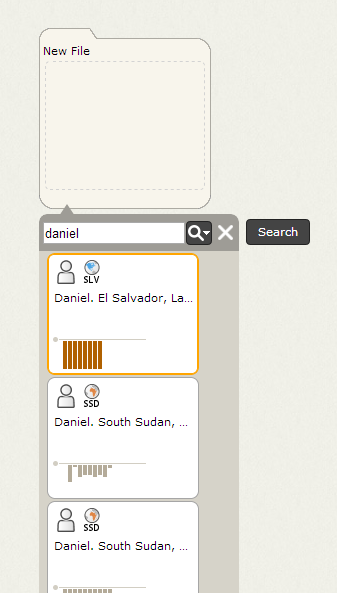
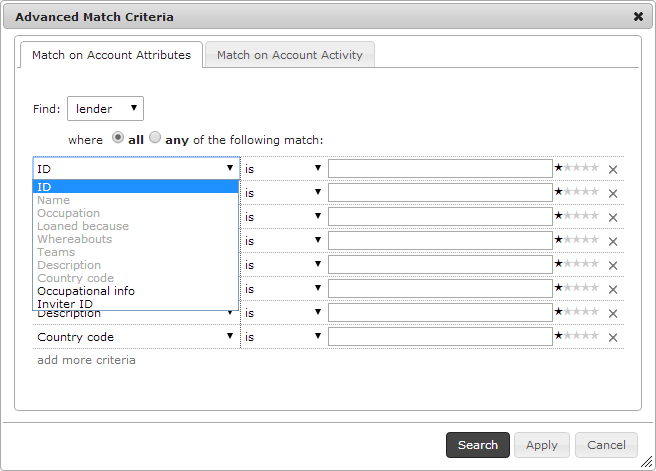

Attribute Search
================

Attribute searches allow you to find accounts by name or other identifying information (e.g., occupation, location or status). When starting a new investigation, this is generally the first search you will perform to find an account of interest and then begin expanding their transaction flows to discover linked accounts and behaviors of interest, such as following the money trail. There are two types of attribute searches:

-   [Basic Search](#basic-search): Allows you to find accounts by name
-   [Advanced Search](#advanced-search): Allows you to find accounts by other identifying attributes and specify matching All/Any and weighting match criteria

Once you have executed a search, you can begin to [navigate the results](#navigating-results), file accounts of interest, investigate their branches and identify patterns of interest.

Basic Search
------------

Influent's basic search functionality enables you to quickly search your data set for the name of an account you want to investigate. To open the Search Panel and find an account with a basic search:

1.  Mouse over the file to which you want to add the results you find.
2.  Click the **Search** button to open the Search Panel.
3.  Enter all or part of the name of the account you want to find in the Search Panel and press the ENTER key.
    

Note that Influent is designed to support fuzzy searching that can correct certain typographical errors in searches and return results similar to what you type. For example, searches for an account named "Jesse" will return results for accounts named "Jesse" and "Jess". How fuzzy searches are interpreted will vary depending on the search engine you use with Influent. The Kiva example uses the [Apache Solr™](http://lucene.apache.org/solr/) search platform.

Advanced Search
---------------

If you do not know the name of the account you want to search for or if you want to narrow down a long list of results, you can use Influent's advanced search capabilities. To perform an advanced search:

1.  Access the Search Panel for the file folder to which you want to add results.
2.  Click the **Advanced Search Options** button  in the Search Panel to open the **Advanced Match Criteria** dialog.
    

The Advanced Match Criteria dialog has two tabs. The first, **Match on Account Attributes**, is an attribute search that enables you to narrow your search results by expanding search criteria beyond the account name. The Account Attribute search can be configured to find accounts with any or all of the criteria you specify, and also non-exact fuzzy matching and weighting of match criteria.

To search for accounts based on a set of attribute criteria:

1.  Choose the **Type** of account for which you want to search. Different account types can have different attributes. In the Kiva data example, there are three types of accounts: Lenders, Loans (Borrowers) and Partners, each with a unique set of attributes.
2.  Determine whether you want Influent to return only results that match **All** of your search criteria or results that match **Any** subset of your criteria.
3.  Configure your search criteria:
    1.  Choose an attribute from the **Criteria** drop-down list.
    2.  Select on of the following options from the **Match** drop-down list:
        -   **Is**: Match or contain your search terms
        -   **Is NOT**: Do not match your search terms
        -   **\~like**: Are similar to your search terms

    3.  In the text box, enter the terms or values for which you want to search.
    4.  If necessary, assign weights to your search criteria to indicate the relative importance of the different attributes. The stars to the right of the text box indicate the importance of the corresponding attribute. More stars mean the term is more important.
    5.  If necessary, click **Add More Criteria** to include additional attributes in your search. Repeat the previous four steps for each criteria you add.

4.  Click **Search**.

Navigating Search Results
-------------------------

By default, Influent returns a paginated list of the top 50 results for the search terms that you entered. Each page contains 12 results. Both of these values are configurable for each deployment of Influent.

Any search result can be added to a file and further investigated by branching its transaction flow to display linked accounts. Once you have identified a pattern of interest, you can use Influent's [activity search](activity-search.md) to locate similar transactions.

