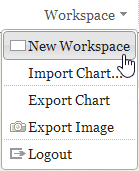
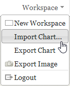
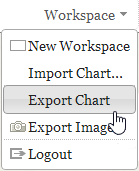
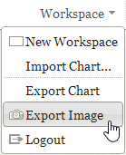
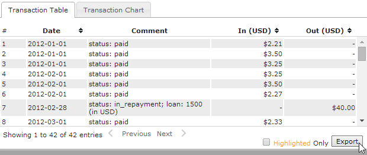
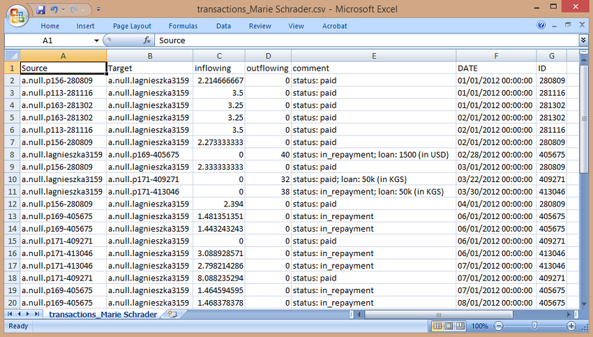

Importing and Exporting Data
============================

Influent enables you to import and export transaction flow data in order to:

-   Save transaction flow data across multiple Influent sessions
-   Share transaction flow data with other analysts that use Influent
-   Share transaction flow data with individuals who do not have access to Influent

File Formats
------------

Influent supports the following file formats:

-   **Influent Files (XML)**: Transaction flow data that can be exported from and imported into Influent is saved as an XML file (\*.infml). This file format enables you to save and work with files, folders and transaction flow information across multiple sessions. Note that Influent XML files do not contain search results or other unfiled accounts loaded in the workspace.
-   **Workspace Images (PNG)**: A complete screenshot of the workspace can be saved as an image that can be easily included in reports or emailed to individuals without access to Influent.
-   **Detailed Transaction History (CSV)**: Detailed transaction history data for an individual account can be exported to a comma-separated values (CSV) file. This information can then be opened or imported into your spreadsheet or database program of choice.

Importing Influent Project Data
-------------------------------

You can use Influent's import functionality to open project data that was saved from a previous session or shared with you by another analyst. Only Influent XML files (\*.infml) are supported for import.

1.  If you are currently working on transaction flow data that you do not want to lose, open a blank workspace in a new tab by selecting **New Workspace** from the **Workspace** menu. Otherwise, the import process will overwrite any information you have in your current workspace.
    
2.  Select **Import Chart** from the **Workspace** menu.
    
3.  Browse to the location of the Influent XML file (\*.infml) you want to import and click **Open**.

Your Influent workspace is refreshed to show the filed accounts, relational transaction flow data and workspace focus contained in the XML file.

Exporting Influent Project Data
-------------------------------

You can use Influent's export functionality to save and share transaction flow data you have loaded in your workspace.

### Exporting Influent Files

Influent files are XML-formatted files that contain all of the filed accounts in your workspace. They also retain the relational links between those accounts and the focus of your workspace (highlighted and selected accounts) at the time of export. To export an Influent XML file:

1.  Make sure that all of the accounts you want to save are filed in the workspace. Unfiled accounts and search results will not be saved to the XML file.
2.  Select **Export Chart** from the **Workspace** menu.
    
3.  The XML is automatically saved to the download location specified in your Web browser (e.g., *C:\\Users\\jsmith\\Downloads*) as *influent-saved.infml*. It is recommended that you rename the XML file to indicate when it was generated and/or the nature of its contents.

### Exporting Transaction Flow Images

You can save your transaction flow data as an image that can be included in a report or shared with individuals without access to Influent. Exported images show the entire Influent workspace (i.e., accounts in the workspace, in files and in the Search Results) and the header with the Transaction Flow period. Note that exported images do not include the Details Pane for the selected account. To export an image of the transaction flow data in your workspace:

1.  Select **Export Image** from the **Workspace** menu.
    
2.  The PNG is automatically saved to the download location specified in your Web browser (e.g., *C:\\Users\\jsmith\\Downloads*) as *influent-snapshot.png*. It is recommended that you rename the PNG file to indicate when it was generated and/or the nature of its contents.

### Exporting Detailed Transaction Information

The Details Pane lists complete records of the transactions made by the selected account. To export this information from Influent into a CSV file:

1.  Select in the workspace the account for which you want to export the transaction data by clicking on it.
2.  A blue border is drawn on the selected account and the Details Pane is displayed.
3.  Click the **Export** button below the Transaction Table in the Details Pane. Note that while you can filter the Transaction Table to display only transactions made with the highlighted account, your CSV export will still contain a complete list of the selected account's transactions.
    
4.  The CSV is automatically saved to the download location specified in your Web browser (e.g., *C:\\Users\\jsmith\\Downloads*) as *transactions-\<Name of Account\>.csv*. It is recommended that you rename the CSV file to indicate when it was generated and/or the nature of its contents.
    

